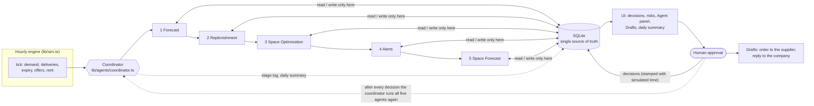

# SmartStock — architecture in five minutes

<div dir="rtl" lang="ar">

**ملخص بالعربية.** SmartStock نظام وكلاء ذكيين (قواعد وليس نماذج لغوية) يعمل محلياً. خمسة وكلاء يعملون بالتتابع بقيادة **منسّق**: *التوقع ← التزويد ← تحسين المساحات ← التنبيهات ← توقع المساحات*. لا ينادي أحدهم الآخر؛ كلٌّ منهم **يقرأ** من قاعدة بيانات واحدة (SQLite) و**يستنتج** بالقواعد و**ينفّذ** بالكتابة فيها ثم **يتحقق** من نتيجته بفحص ذاتي سريع (إن فشل أُعيد تشغيله مرة، وإن فشل ثانية يظهر تحذير دون إيقاف المحاكاة). يسجّل كل وكيل هذه المراحل الأربع في كل تشغيل (لوحة «الوكلاء»، وتبويب «كيف يعمل الوكلاء» في المساعدة). الوكلاء يقترحون فقط: **كل قرار يعتمده إنسان** (طلبات الشراء، رسائل الموردين، الإعلان عن مساحة، قبول العروض أو رفضها أو الرد عليها)، وبعد القرار تُجهَّز **مسودة رسالة** جاهزة (إلى المورد أو إلى الشركة) بالعربية والإنجليزية. يتدفق العمل في مسارين: **المشتريات** و**تأجير المساحات**، ويلتقيان عند فحص المساحة (الإيجار الموقّع يسبق الشراء الجديد) وتنبيهات التعارض. الجدول أدناه يُولَّد تلقائياً من سجل الوكلاء `lib/agents/registry.ts`.

</div>

**In one paragraph.** SmartStock is a rule-based multi-agent system (no LLM is needed or called) for the fictional chitosan producer Qeshour. An hourly simulation moves the clock; a **coordinator** runs five **agents** in a fixed order; the agents never call each other — they **READ** the shared SQLite database, **REASON** with rules and formulas (`lib/calc`), **ACT** by writing their result back, and **VERIFY** it with a quick self-check. A person approves every decision; the agents only propose.

## 1. The picture



Plain-text version:

```
 hourly engine ──► COORDINATOR ──► 1 Forecast ─► 2 Replenishment ─► 3 Space Optimization ─► 4 Alerts ─► 5 Space Forecast
 (lib/sim.ts)      (runs the list           │             │                  │                │              │
                    from registry.ts)       └─────────────┴──────────┬───────┴────────────────┴──────────────┘
                                                                     ▼
                                          SHARED DATABASE (SQLite) — the only way agents talk to each other
                                                                     ▼
                                       UI ──► HUMAN APPROVES / REJECTS / COUNTERS ──► decisions stored with simulated time
                                                                     ▼
                                 drafts (supplier order, reply to company)  +  coordinator runs all five agents again
```

Every agent works in four visible stages, logged in `agent_steps` after each run and shown in **More → Agents** (and explained in **Help → How the agents work**):

| stage | what the agent says |
|---|---|
| READ | what it read (counts from the tables) |
| REASON | what it decided (rules, formulas from `lib/calc`) |
| ACT | what it wrote (rows, drafts, alerts) |
| VERIFY | the result of its own check; if it fails the agent runs once more (`agents.verify_retries`), and if it still fails an event and a red badge show it — the simulation is never blocked |

## 2. The five agents

The table is generated from `lib/agents/registry.ts` and the locale files by `npm run docs:agents` (a test fails if it drifts). Every agent file starts with the same header (Name, Stage, Role, Reads, Writes, VERIFY, Runs when, Hands over to); a test checks the header against the registry.

<!-- agents:start (generated by npm run docs:agents - do not edit) -->
| # | Agent (EN / AR) | Stage | Role | Reads | Writes | Runs (setting) | VERIFY (self-check) | File |
|---|---|---|---|---|---|---|---|---|
| 1 | **Forecast** / التوقع (`forecast`) | READ | Turns the movement history into weekly usage, a seasonal forecast and flags for sudden demand jumps. | `items`, `stock_movements`, `demand_log`, `current_stock`, `purchase_orders_open`, `settings` | `forecasts` | `schedule.forecast_hours` + after every decision | No negative or invalid value in the forecast; Every item has a forecast | `lib/agents/forecast.ts` |
| 2 | **Replenishment** / التزويد (`replenishment`) | REASON | Decides which items need an order, how much and in what order, within the free budget and the room of each zone. | `forecasts`, `items`, `current_stock`, `purchase_orders_open`, `purchasing_budget`, `warehouse_zones`, `space_leases`, `recommendations` | `replenishment_plan`, `recommendations`, `events` | `schedule.replenishment_hours` + after every decision | Order drafts: quantity above zero and a multiple of the step, within budget and room | `lib/agents/replenishment.ts` |
| 3 | **Space Optimization** / تحسين المساحات (`space-optimization`) | REASON | Works out, zone by zone, how much area the stock uses, how much is held back and how much can be rented out. | `warehouse_zones`, `current_stock`, `items`, `space_leases` | `zone_space` | `schedule.space_hours` + after every decision | No zone above its capacity and no negative rentable area | `lib/agents/space-optimization.ts` |
| 4 | **Alerts** / التنبيهات (`alerts`) | ACT | Raises a warning for every risk: what is wrong, why, and what happens if it is ignored. Drafts supplier messages for the serious ones. | `forecasts`, `items`, `current_stock`, `purchase_orders_open`, `replenishment_plan`, `zone_space`, `purchasing_budget`, `recommendations`, `suppliers` | `alerts`, `recommendations`, `events` | `schedule.alerts_hours` + after every decision | Every alert has a known kind, severity and a what / why / if-ignored message; none twice | `lib/agents/alerts.ts` |
| 5 | **Space Forecast** / توقع المساحات (`space-forecast`) | REASON | Looks ahead for space the company will not need, keeps what it must keep, and flags conflicts between rentals and purchasing. | `forecasts`, `items`, `current_stock`, `purchase_orders_open`, `recommendations`, `warehouse_zones`, `space_leases`, `space_listings`, `space_offers`, `space_decisions` | `space_forecasts`, `alerts`, `space_offers`, `events` | `schedule.space_plan_hours` + after every decision | Listed area never above its free window; Leased area plus the company's own need within the zone capacity | `lib/agents/space-forecast.ts` |
<!-- agents:end -->

Shared checks live in `lib/checks.ts` and are used both by the agents' VERIFY stage and by the hourly audit (`lib/audit.ts`), so a rule is written once.

## 3. The shared database — who writes what

| table(s) | written by |
|---|---|
| `items`, `suppliers`, `stock_movements` (history), `current_stock`, `purchase_orders_open` (data rows), `purchasing_budget`, `warehouse_zones`, `space_requests` | seed from `smartstock_data/*.csv` (`lib/seed.ts`) — business data, never typed in code |
| `settings` | seed from `config/defaults.json`; edited in the Settings screen |
| `stock_movements` (simulated), `current_stock`, `demand_log`, `purchase_orders_open` (arrivals), `sim_state` | the hourly engine (`lib/sim.ts`, `lib/stock.ts`) |
| `forecasts` | **Forecast** |
| `replenishment_plan`, PO drafts in `recommendations` | **Replenishment** |
| `zone_space` | **Space Optimization** |
| `alerts`, supplier-message drafts in `recommendations` | **Alerts** (and the conflict alerts of **Space Forecast**) |
| `space_forecasts`, conflict flags | **Space Forecast** |
| `space_listings`, `space_offers`, `space_leases`, `space_decisions` | the human's space decisions (`lib/space/market.ts`) and the hourly space engine (offers arrive, leases start and end, rent accrues) |
| `decisions`, `purchase_orders_open` (approved orders), `budget_topups` | the human's decisions (`lib/decisions.ts`) |
| `drafts` | created right after a human decision (`lib/drafts.ts`); the manager edits them and marks them sent |
| `agent_runs`, `agent_steps`, `daily_summary`, `events` | the coordinator and the agents (`lib/agents/*`, `lib/summary.ts`) |
| `audit_results` | the data-health check (`lib/audit.ts`) |

## 4. The hourly schedule

One tick = one simulated hour, inside one database transaction (`lib/sim.ts`):

1. the engine books the hour: demand is issued (FEFO), deliveries arrive at their hour, lots expire, offers arrive / expire, leases start and end, rent accrues;
2. the clock moves to the next hour;
3. the coordinator runs the agents that are due, **always in registry order**. Defaults (all editable settings): Forecast `06:00`; Replenishment and Space Optimization `08:00`; Alerts and Space Forecast **every hour**;
4. after the `summary.hours` hour (default `08:00`), after **Run analysis**, and at the start the coordinator writes the **daily summary** from the database: top risks, decisions waiting (count, oldest age), budget used / free, space listable / leased / income, offers waiting;
5. old log rows are pruned.

After **every human decision** the coordinator runs all five agents again in the same hour, so the plan, the alerts and the space forecast react immediately.

## 5. The two flows and how they meet

* **Purchasing** — stock, demand forecast, reorder point, budget periods with emergency requests, purchase-order drafts, supplier messages. Decisions: approve / reject / postpone / edit quantity of a draft; approve or refuse emergency spend; approve a supplier message. After an approval the order message for the supplier is drafted.
* **Space** — free-window forecast, listing, offers, counter-offers, leases and rental income. Decisions: keep a window empty or list it; accept, reject or counter an offer; pause, shrink or withdraw a listing. Each decision drafts the reply to the company with the reason found by the automatic checks.

They meet in two places, both through the database:

* **Room check.** Replenishment sizes every order draft by the room each zone has when the order arrives; a signed lease takes room away from its start to its end (`leasedOn` in `lib/zones.ts`, the only rental data purchasing reads).
* **Conflicts.** Space Forecast reads purchasing outputs (open orders, PO drafts, stock, demand forecast) to know what the company itself needs. When an approved order squeezes a published listing, or a waiting offer needs space the company now needs, it raises an alert in **both** flows (`LISTING_RISK`, `OFFER_BLOCKED`, `LEASE_OVER`); a signed lease is never cancelled automatically.

## 6. Human-in-the-loop points

| where | the person | stored as |
|---|---|---|
| Needs your decision (Purchasing) | approve / reject / postpone a purchase order; change its quantity; approve emergency spend; approve a supplier message | `decisions`, `recommendations`, `budget_topups` |
| Needs your decision (Space) | keep a window empty or list it; accept / reject / counter an offer; pause, shrink, withdraw a listing | `space_decisions` |
| Undo toast | undo what can still be undone | the decision row is removed together with its draft |
| More → Drafts | edit the wording of the supplier order or the reply, send it, mark it as sent | `drafts` |
| More → Do it yourself | manual order, emergency order, stock movement with a reason, new company request | `decisions` |

Every decision carries its simulated time and shows in **After your decisions** with what it led to.

## 7. Where to find what

```
app/                  Next.js pages and API routes (app/api/{sim,agents,drafts,recommendations,space/*})
components/           React UI: Dashboard, AgentPanel, HowAgentsWork, SummaryCard, DraftsPanel, space/*
lib/agents/           THE AGENTS: forecast, replenishment, space-optimization, alerts, space-forecast
lib/agents/registry.ts   the single list of agents; coordinator.ts runs it; steps.ts = stage log + VERIFY helpers
lib/checks.ts         checks shared by the agents' VERIFY stage and the audit
lib/calc/             every formula, pure and unit-tested
lib/sim.ts, clock.ts  the hourly engine and the clock; stock.ts = receiving / issuing
lib/decisions.ts      the human's purchasing decisions (approve, reject, undo, manual)
lib/space/            the rental flow: forecast (projection), market (offers, leases), snapshot
lib/zones.ts, budget.ts   zone figures and budget periods shared by both flows
lib/drafts.ts         ready-to-send drafts;  lib/summary.ts = the daily summary
lib/db.ts, seed.ts    schema and seeding;  snapshot.ts = the one JSON the UI reads
lib/audit.ts          invariants (hourly and daily);  lib/llm.ts = optional, off without a key
locales/              en.json, ar.json — generated by scripts/locales_*.py (npm run locales)
config/defaults.json  every threshold and schedule (the settings table)
smartstock_data/      the CSV business data
scripts/              seed, audit, check, literals, locales_*, docs-agents
tests/                the test suite (agents, space, budget, offers, calc, sim, ui, i18n)
docs/                 this file, reports/ (audit, baseline), notes/, screenshots by topic (index: docs/README.md)
```

## 8. How to check it

```bash
npm test            # unit + integration tests, including the agent stage log, forced-failure re-run, summary, drafts and registry tests
npm run audit       # 30 days x 3 seeds, thousands of invariants every hour (every run has 4 stages, every approved order has a draft ...)
npm run literals    # no hard-coded business literals in app/, components/, lib/
npm run docs:agents # regenerates the agent tables of this file and of the README
```
